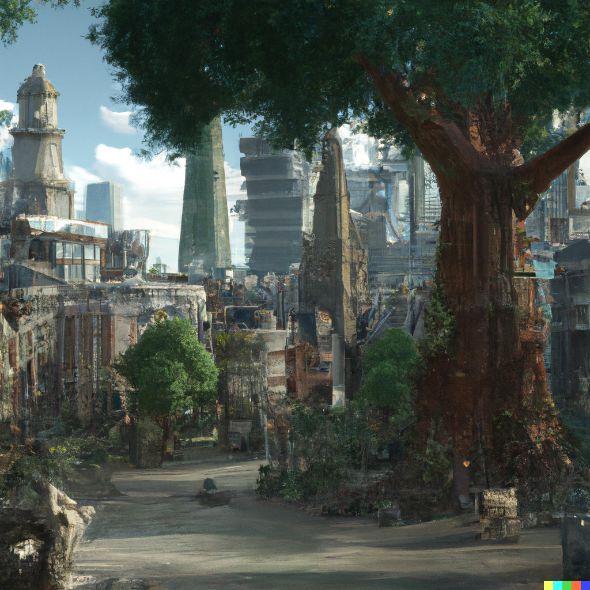
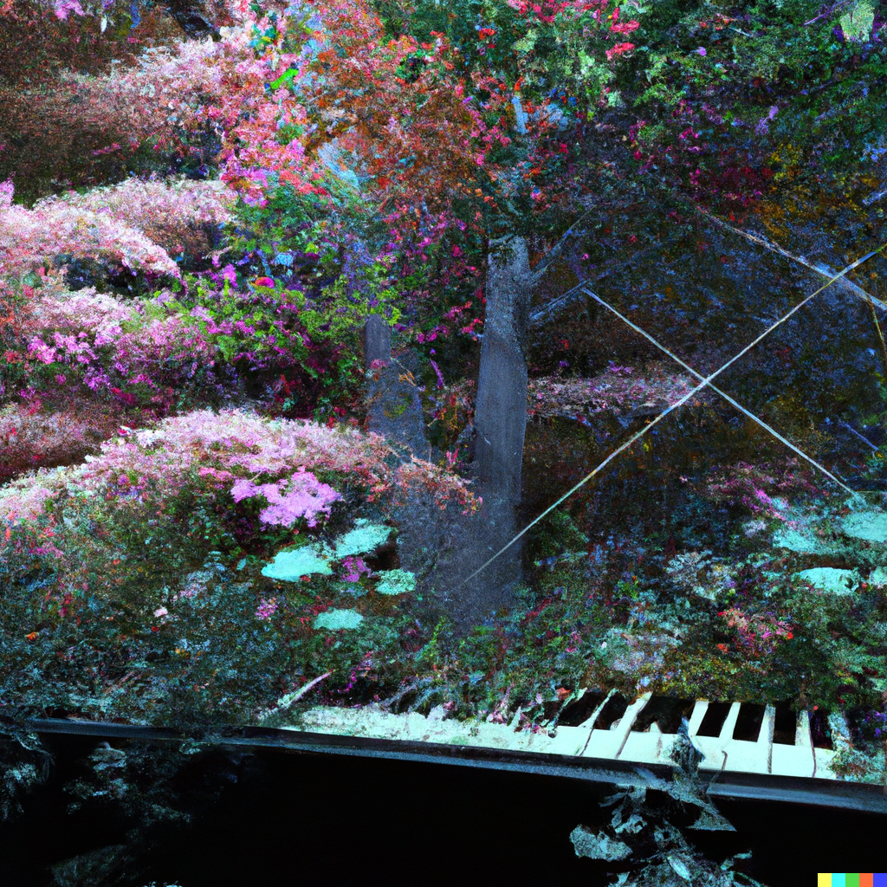

### Welcome to my page!

Hi, I'm Leo. I'm a full-stack software engineer currently living in London. 

### Here are some of my projects:
<table>
  <thead align="center">
    <tr border: none;>
      <td><b>Projects</b></td>
      <td><b>Frontend</b></td>
      <td><b>Backend</b></td>
      <td><b></b></td>
    </tr>
  </thead>
  <tbody>
    <tr>
      <td><a href="https://wordle-clone-multiplayer.netlify.app/"><b>Wordle Clone Multiplayer 🟩⬛🟨</b></a></td>
      <td><a href="https://github.com/leo-mj/wordle-guess-marker"><b>React</b></a></td>
      <td><a href="https://github.com/leo-mj/wordle-platform-backend"><b>PostgreSQL Express Node.js</b></a></td>
      <td><b>Solo</b></td>
    </tr>
    <tr>
      <td><a href="https://c5c1-frontend.netlify.app/"><b>Platform for Sharing Learning Resources 📖<b></a></td>
      <td><a href="https://github.com/Wilrosmi/C5C1-frontend"><b>React</b></a></td>
      <td><a href="https://github.com/Wilrosmi/C5C1-backend"><b>PostgreSQL Express Node.js</b></a></td>
      <td><b>Collab</b></td>
    </tr>
    <tr>
      <td><a href="https://team2-dog-breed-voter.netlify.app/"><b>Election of the Cutest Dog 🐶</b></a></td>
      <td><a href="https://github.com/leo-mj/dog-breed-voter-frontend"><b>React</b></a></td>
      <td><a href="https://github.com/leo-mj/dog-breed-voter-backend"><b>PostgreSQL Express Node.js</b></a></td>
      <td><b>Collab</b></td>
    </tr>
  </tbody>
</table>

You can head over to my <a href="https://leo-mj.notion.site/Leo-s-Portfolio-6e82a956f6b748cbb7e6e7e3eac26dee">portfolio</a> for more details!

### Currently learning to use:
<ul>
  <li> 
    <a href="https://socket.io/">Socket.io</a>
    
  </li>
  <li>
    <a href="https://www.cypress.io/">Cypress</a>
    
  </li>
  <li>
    <a href="https://www.blender.org/">Blender</a>
    
  </li>
</ul>

### Creative Coding:

p5.js sketches: <a href="https://openprocessing.org/user/334096?view=sketches&o=12">
  <b>Open Processing</b>
  
</a>

Some Midjourney and Dall-E 2 creations:

<table>
  <tbody>
    <tr>
      <td></td>
      <td></td>
      <td rowspan="2"></td>
    </tr>
    <tr>
      <td align="center" colspan="2"></td>
    </tr>
  </tbody>
</table>

### How to reach me:

